<!-- _class: invert -->

# Multiresolution Spectral  Representation of Neural Media

## Hallison Paz

#### PhD Defense - IMPA, November 25th, 2024

<!-- _paginate: false -->

---

<!-- _class: invert -->

> # ... our goal is to derive a multiresolution representation of media objects using neural networks...

<!-- _footer: from "Motivation" section. -->
<!-- _paginate: false -->
---

# Neural Media

---

# Representational Networks

- Continuous function
- Compact
- New methods/operations

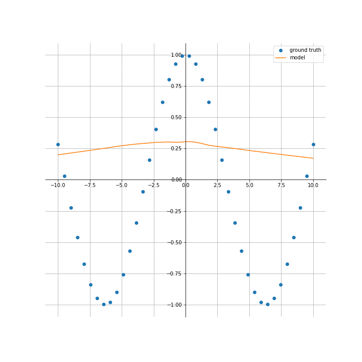

<!-- _footer: Image: training of a ReLu MLP to fit a cosine wave -->

----

## Fitting a MLP using ReLu

----

----

<!-- _footer: Check [paper website](https://bmild.github.io/fourfeat/) -->

----

<!-- _footer: Check [paper website](https://www.vincentsitzmann.com/siren/) -->

----

## Fitting a sinusoidal MLP

---

# Spectral Representation

---

# Multiresolution

---

# Why?

---

# Contributions

<!--  -->

- **Comprehensive study on the initialization of sinusoidal neural networks**
<!-- - Family of neural architectures for encoding media objects at multiple resolutions
- Flexible framework for training multi-stage neural networks
- Application of our architecture in multiresolution imaging.
- Fourier Series-based initialization strategy for periodic functions
- technique based on the Poisson Equation to generate seamless material textures.
- our architecture can be integrated into the rendering pipeline of textured objects. -->

<!-- _footer: Based on dissertation's page 5 -->

---
<!-- _backgroundColor: #003463-->
<!-- _class: invert -->
<!-- _paginate: false -->

# Frequency Dynamics in Sinusoidal Neural Networks

---

# Shallow Network

###### A perceptron:
$y = \sin(Wx + b)$

###### A shalow network:
$f(x) = a_0 + \sum_{j=1}^m a_j \sin\left(\omega_j x + \varphi_j\right)$

---

# Shallow Network

<!-- _footer: Figure 3.2 Reconstruction of a signal with four distinct frequencies, where the lower frequencies   fall within  the initialization range of the network’s first layer. -->

---

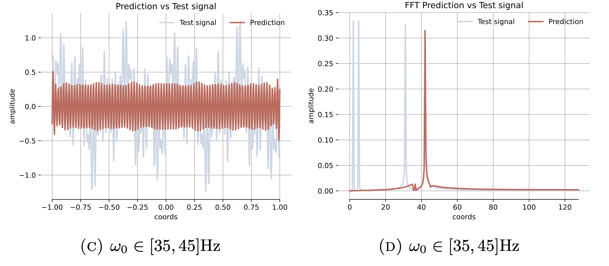

<!-- _footer: Figure 3.3: Reconstruction of a signal with four distinct frequencies, where only the higher frequencies   fall within the initialization range  of the network’s first layer. -->

---

### Capacity matters

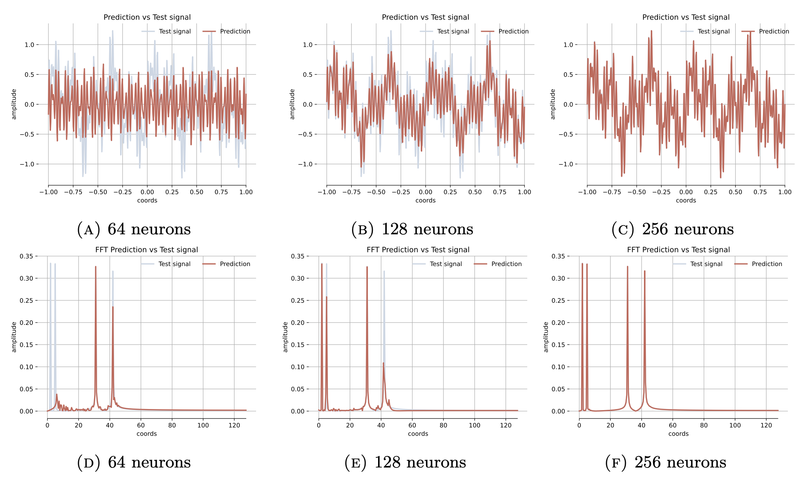

<!-- _footer: Figure 3.4: Reconstruction of the signal using networks with different width, all initialized with frequencies in [−45, 45] Hz. -->

---

> ...a shallow network with only one layer of sinusoidal activation functions can filter a signal by band-limiting its frequency content...

<!-- _footer: From page 28. -->

---

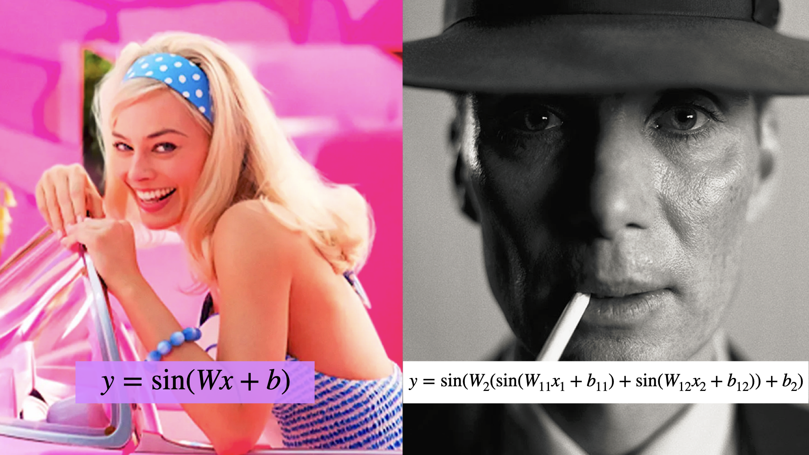

<!-- _paginate: false -->

---

## Composition of sines generates much more frequencies

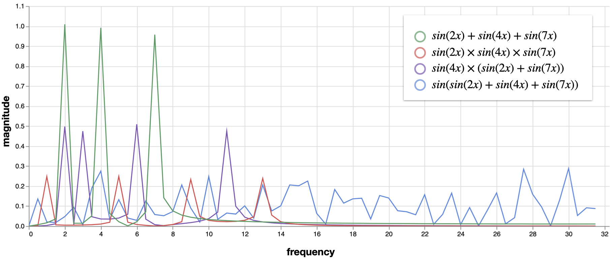

----
<!-- 
 -->

<!-- # 1 Hidden Layer - low frequencies -->

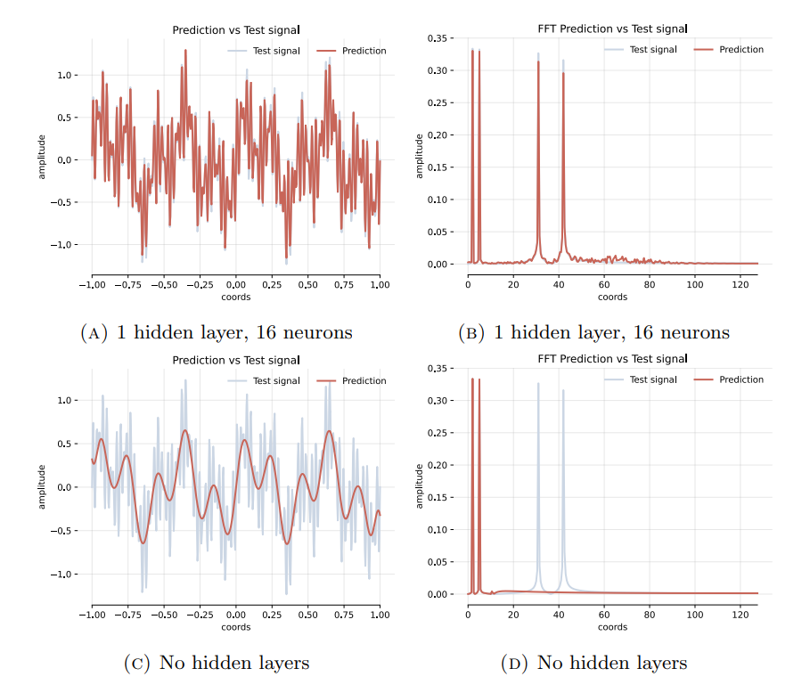

<!-- _footer: TOP: single hidden layer;   LEFT (Figure 3.6): lower frequencies initialization; RIGHT (Figure 3.7): higher frequencies initialization.   -->

<!-- _paginate: false -->

---

<!-- _backgroundColor: #003463-->
<!-- _class: invert -->
<!-- _paginate: false -->

# Stochastic Signals

---

# Perlin Noise

<!-- _footer: Figure 3.12: Smoothed reconstruction with 1 hidden layer -->

---

# By the way...

<!-- _class: invert -->
<!-- _paginate: false -->

<!-- _footer: Met professor Ken Perlin at SIGGRAPH'24 -->

---

<!-- _backgroundColor: #003463-->
<!-- _class: invert -->
<!-- _paginate: false -->

# Multiresolution Sinusoidal Neural Networks

---

# Contributions

- Comprehensive study on the initialization of sinusoidal neural networks
- **Family of neural architectures for encoding media objects at multiple resolutions**
- **Flexible framework for training multi-stage neural networks**
<!-- - Application of our architecture in multiresolution imaging.
- Fourier Series-based initialization strategy for periodic functions
- technique based on the Poisson Equation to generate seamless material textures.
- our architecture can be integrated into the rendering pipeline of textured objects. -->

<!-- _footer: Based on dissertation's page 5 -->

---

# Multiscale Decomposition

- Let $\mathscr{f}:\mathcal{D}\to \mathcal{C}$ be a *ground-truth signal*

- We decompose it into a sum of $N$ stages: 

$$\mathscr{f}=\mathscr{g}_0 + \dots + \mathscr{g}_{N-1}$$
, 
<!-- where $\gt{g}_0$ captures the coarsest approximation of the signal and $\gt{g}_i$, for $i>0$, progressively introduces higher-frequency components.  -->
- $\mathscr{g}_0$ represents the coarsest features

---

# Multiscale decomposition

The *level of detail* at stage $i$ is defined as:

$$
\mathscr{f}_i = \mathscr{g}_0 + \cdots + \mathscr{g}_i \quad \text{or} \quad \mathscr{f}_i = \mathscr{f} - \sum_{j=i+1}^{N-1} \mathscr{g}_j.
$$

Each stage $\mathscr{g}_i$ is computed as:
$$
\mathscr{g}_i = \mathscr{f}_{i+1} - K * \mathscr{f}_{i+1}, \quad \text{where } \mathscr{f}_{N-1} = \mathscr{f}.
$$

---

Example: TOP: $\mathscr{g}_i$ | Bottom: $\mathscr{f}_i$

<!-- _backgroundColor: #000000-->

<!-- _class: invert -->

---

**Contrast enhanced**: TOP: $\mathscr{g}_i$ | Bottom: $\mathscr{f}_i$

  

<!-- _backgroundColor: #000000-->

<!-- _class: invert -->

---

## Multiresolution [Sinusoidal] Neural Networks (MR-Net)

 

$$f:\mathcal{D} \times [0,N] \to \mathcal{C}$$
 

$$f(x,t) = c_0(t) g_0(x) + \cdots + c_{N-1}(t) g_{N-1}(x)
$$
 

$c_i(t) = \max \Big\{ 0, \min \big\{ 1, t - i \big\} \Big\}.$

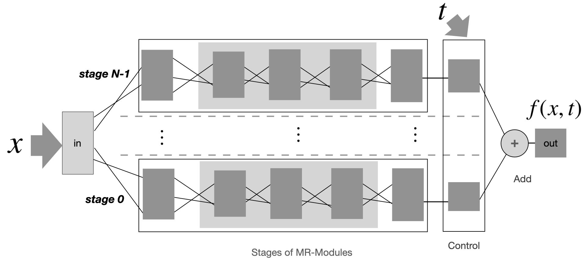

---

# MR-Module
 
 

---

# Shallow Network (S-Net)

 

<!-- 

 -->

  

---

# Laplacian Network (L-Net)

 

  

---

# Modulated Network (M-Net)

 

  

---

# Multiresolution Training

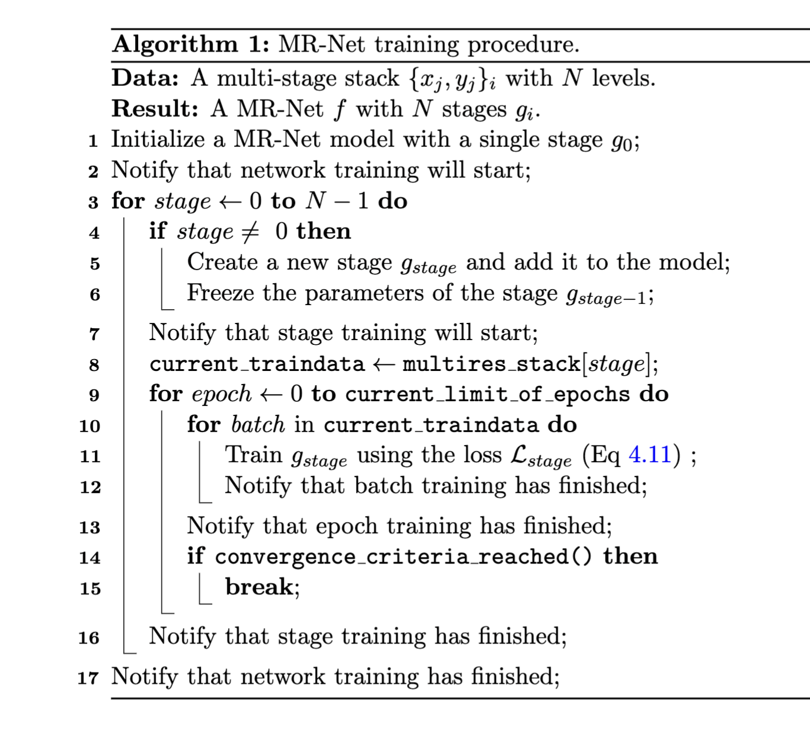

---

# Training elements

### Frequency Initialization

### Loss function

$$\mathcal{L}_i(\theta_i)=\frac{1}{K_i}\sum ||f_i(x_j)-y_j||^2.$$

---

<!-- _backgroundColor: #003463-->
<!-- _class: invert -->
<!-- _paginate: false -->

# Multiresolution Imaging

---

# Contributions

- Comprehensive study on the initialization of sinusoidal neural networks
- Family of neural architectures for encoding media objects at multiple resolutions
- Flexible framework for training multi-stage neural networks
- **Application of our architecture in multiresolution imaging.**
<!-- - Fourier Series-based initialization strategy for periodic functions
- technique based on the Poisson Equation to generate seamless material textures.
- our architecture can be integrated into the rendering pipeline of textured objects. -->

<!-- _footer: Based on dissertation's page 5 -->

---

# M-Net is more compact

---

# Multiresolution image representation

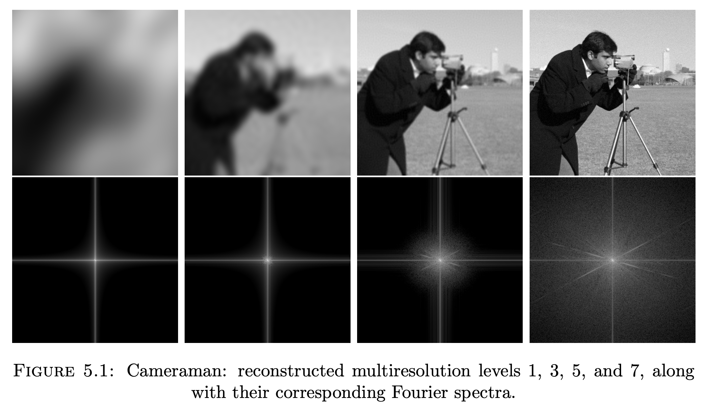

---

# More natural than Bacon

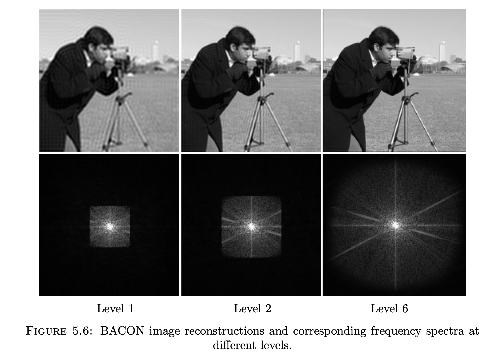

<!--  -->

---

# Comparable to Siren

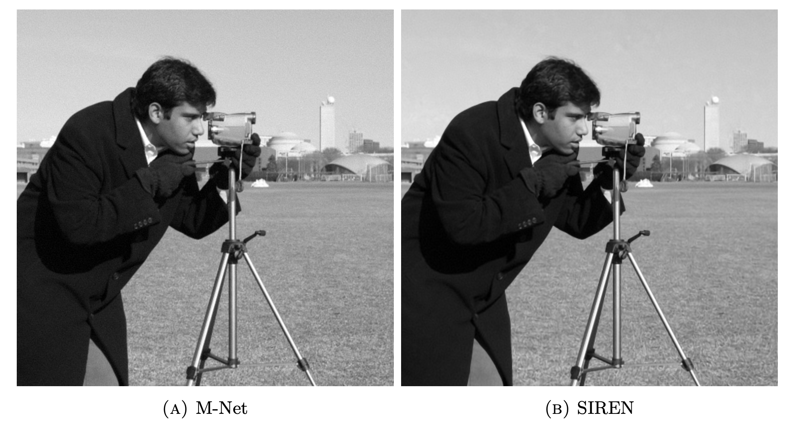

---

# 7 levels of Multiresolution with same size

---

# Texture magnification / minification

---

# Continuous Scale

<video width="1200" height="800" controls>
  <source src="assets/multiresolution-masp.mp4" type="video/mp4">
</video>

---

# Anti-aliasing

---

<!-- _backgroundColor: #003463-->
<!-- _class: invert -->
<!-- _paginate: false -->

# Periodic Textures

---

# Contributions

- Comprehensive study on the initialization of sinusoidal neural networks
- Family of neural architectures for encoding media objects at multiple resolutions
- Flexible framework for training multi-stage neural networks
- Application of our architecture in multiresolution imaging.
- **Fourier Series-based initialization strategy for periodic functions**
- **Demo of architecture integration into the rendering pipeline of textured objects.**
<!-- - Technique based on the Poisson Equation to generate seamless material textures. -->

---

## Siren extrapolation

<!-- _class: invert -->

 

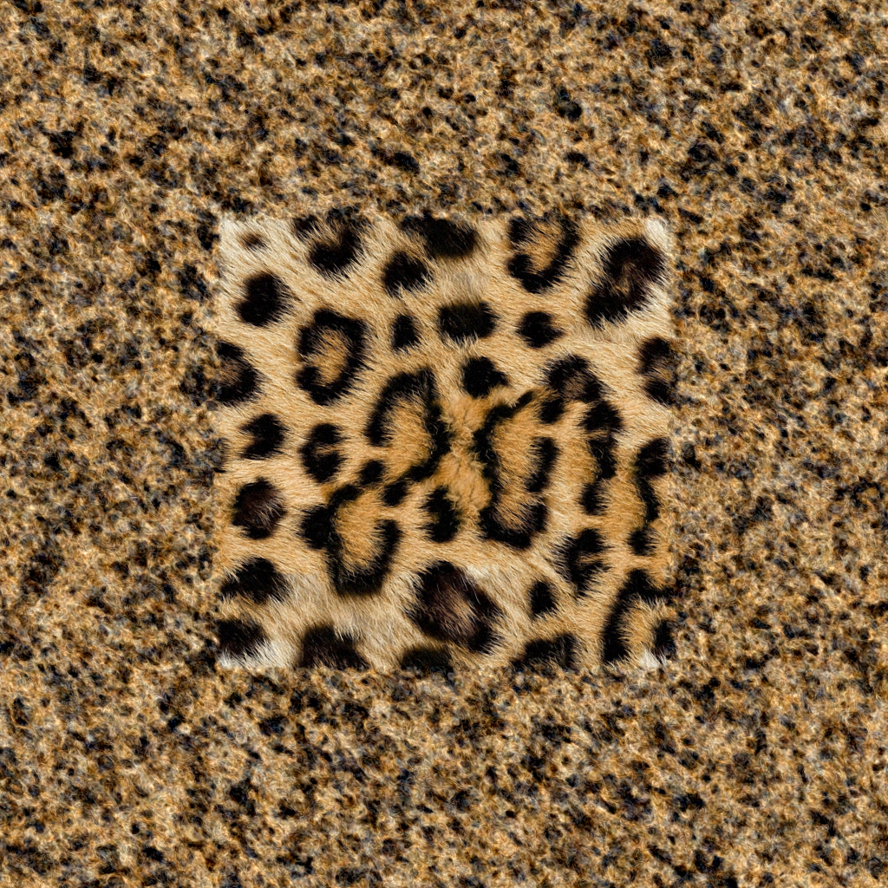

---

# Periodic Image

$\mathscr{f}:\mathbb{R}^2\to \mathbb{R}$,  $\mathscr{f}(x) \!=\! \mathscr{f}(x + P)$  with $P=(P_1, P_2)\in \mathbb{R}^2$ 

### Shallow sinusoidal networks

$$f(x) = L\circ S(x) =  c_0 + \sum_{i=1}^{n} c_i  \sin\Big(\langle{\omega_i}, { x}\rangle+ \varphi_i\Big)$$

- if $\omega_i = \frac{2\pi}{P}$ then a shallow network is periodic. 

###### What about a deep sinusoidal network?

---

# Periodic Neural Networks

$$f(x) = L\circ H \circ \,S(x),$$
$$H\circ S(x):=\sin\big(W \cdot S(x)+b\big)$$

$$h_{i}\circ s(x) = \sin\Big(\sum_{j=1}^{n} W_{ij}\sin\Big(\langle{\omega_j}, {x}\rangle +\varphi_j\Big) + b_{i}\Big)$$

 

From Novello [2022]:

$$h(x)= \!\!\sum_{\textbf{l}\in\mathbb{Z}^n}\left[\prod_{i=1}^n J_{l_i}(a_i)\right]\sin\Big(\langle{\textbf{l}}, {\omega x +\varphi}\rangle+ b\Big)$$

---
# Periodic Neural Networks

### Theorem
>If the first layer of a sinusoidal MLP $f$ is periodic with period $P$, then $f$ is also periodic with period $P$.

<!-- _class: invert -->

---

# Frequency Initialization

$$\sin(\omega_i x + \varphi_i) = \cos(\varphi_i) \sin(\omega_i x) - \sin(\varphi_i)\sin\left(-\omega_i x + \frac{\pi}{2}\right)  $$

> ...we only need to sample the integer values $k_j$ from the half-square $\textbf{K} = [0, B] \times [-B, B]$ 

---

# Frequency Initialization

<!-- 
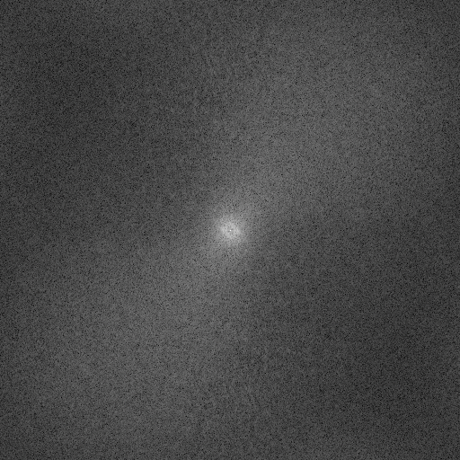

 -->

<table>
  <tr>
    <td>  
(A)
 </td>
    <td>
(B)
</td>
    <td>
(C)
</td>
    <td>
(D)
</td>
   </tr> 
</table>

<!-- _footer: Figure 6.2: (A) Chosen frequencies for initialization; (B) Fourier transform of the trained model;   (C) Seamless reconstruction in $[−2,2]^2$; (D) Training data in $[−1,1]^2$ -->

---

# Periodic Textures

---

# Sample can be given anywhere

---

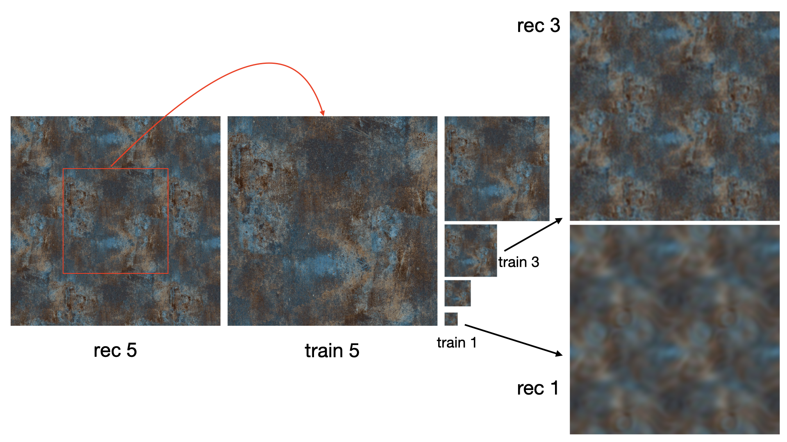

<!-- _footer: Multiresolution using M-Net -->

---

# Surface Texture Mapping

---

<video width="1200" height="700" controls>
  <source src="assets/periodicbrown.mov" type="video/mp4">
</video>

---

<video width="1200" height="700" controls>
  <source src="assets/periodicmoss.mov" type="video/mp4">
</video>

---

<video width="1200" height="700" controls>
  <source src="assets/torus_dirty.mov" type="video/mp4">
</video>

---

<video width="1200" height="700" controls>
  <source src="assets/toro-marrow.mov" type="video/mp4">
</video>

---

<!-- _backgroundColor: #003463-->
<!-- _class: invert -->
<!-- _paginate: false -->

# Seamless Textures

---

# Contributions

- Comprehensive study on the initialization of sinusoidal neural networks
- Family of neural architectures for encoding media objects at multiple resolutions
- Flexible framework for training multi-stage neural networks
- Application of our architecture in multiresolution imaging.
- Fourier Series-based initialization strategy for periodic functions
- Demo of architecture integration into the rendering pipeline of textured objects.
- **Technique based on the Poisson Equation to generate seamless material textures.**

---

$$\mathscr{L}(\theta)={\int_{\Omega} \lambda||{{J}({f})-U}||^2dx} + {\int_{\Omega} (1-\lambda)\big(\gt{f}-f\big)^2dx}$$

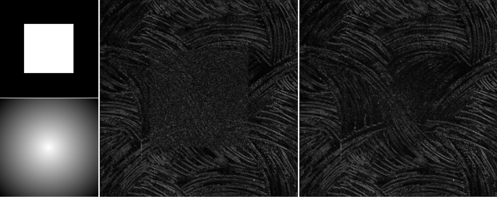

---

---

---

<!-- _backgroundColor: #003463-->
<!-- _class: invert -->
<!-- _paginate: false -->

# Conclusion

---

# Thanks